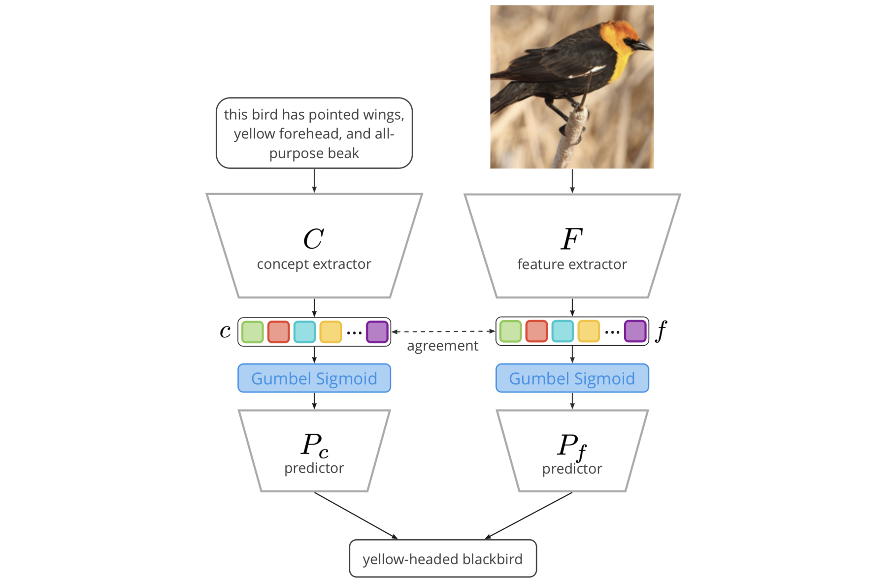

# Cross-Modal Conceptualization in Bottleneck Models

> How can you start talking to your model in the same concepts?

## 🎯 Abstract

Concept Bottleneck Models (CBMs) assume that training examples (e.g., x-ray images) are annotated with high-level concepts (e.g., types of abnormalities), and perform classification by first predicting the concepts, followed by predicting the label relying on these concepts. The main difficulty in using CBMs comes from having to choose concepts that are predictive of the label and then having to label training examples with these concepts. In our approach, we adopt a more moderate assumption and instead use text descriptions (e.g., radiology reports), accompanying the images in training, to guide the induction of concepts.



Our cross-modal approach (see above) treats concepts as discrete latent variables and promotes concepts that (1) are predictive of the label, and (2) can be predicted reliably from both the image and text. Through experiments conducted on datasets ranging from synthetic datasets (e.g., synthetic images with generated descriptions) to realistic medical imaging datasets, we demonstrate that cross-modal learning encourages the induction of interpretable concepts while also facilitating disentanglement. Our results also suggest that this guidance leads to increased robustness by suppressing the reliance on shortcut features.


## 🚀 Getting Started
1. Set-up conda environment
    ```
    make set-up-env
    ```
2. Create `.env` file from `.env.example` — optional, only if you're using Telegram to check pipelines
3. Set-up experiment registry in clear-ml
    ```
    clearml-init
    ```
4. Download data for Shapes, CUB-200, MSCOCO, MIMIC-CXR
    ```
    make download_data
    ```
5. Pre-process CUB-200
    ```
    make preprocess_cub
    ```
6. Pre-process MIMIC-CXR
    ```
    make preprocess_mimic
    ```
7. Now you're ready to run your first experiment! Checkpoints and explanations will appear in hydra `outputs/` directory (already in `.gitignore`).
    ```
    python main.py dataset.batch_size=64 seed=42 +experiment={XXX}
    ```


## 🤔 FAQ

1. How can I retrieve explanations?
    > Our pipeline saves explanations in `results.json`, which can be found in experiment folder. For visualization you can use [`inspect.ipynb`](notebooks/inspect.ipynb) notebook.

2. How can I assess my model in terms of DCI?
    > Measuring disentanglement, completeness, informativeness is moved outside the default pipeline and can be performed via [`metrics.ipynb`](notebooks/metrics.ipynb) notebook.


## 🧬 Experiments

Following table helps you to navigate through all experimental setups. The configurations files are located in [this directory](autoconcept/config/conf/). However, some of them are outdated and left to revise our hypotheses later (for clarity we omit them in navigation table below). Feel free to reuse our setups and add new ones [here](autoconcept/config/conf/experiment).

| Model     | EID-DATASET  | pretrained | act_fn  | norm_fn  | slot_norm | dummy_concept | dummy_tokens | reg_dist | tie_loss*   |
|:------------|:-----------|:-----------:|:----------|:----------|:----------:|:-------------:|:---------------:|:---------------:|:---------------|
| Standard | E35-SHP | ✓ | relu | - | - | -| - | - | - |
| Standard | E36-SHP | ✓ | sigmoid  | - | - | - | - | - | - |
| Standard | E36-CUB | ✓ | sigmoid  | - | - | - | - | - | - |
| Standard | E36-MIM | ✓ | sigmoid  | - | - | - | - | - | - |
| Standard | E36-SHP-NOROBUST | ✓ | sigmoid  | - | - | - | - | - | - |
| Standard | E37-SHP | ✓ | gumbel  | - | - | - | - | - | - |
| XCBs | E38-SHP | ✓ | sigmoid | softmax | ✗ | - | - | ✗ | JS($f, c$) |
| XCBs | E39-SHP | ✓ | gumbel | softmax | ✗ | - | - | ✗ | JS($f, c$) |
| XCBs | E39-CUB | ✓ | gumbel | softmax | ✗ | - | - | ✗ | JS($f, c$) |
| XCBs | E39-MIM | ✓ | gumbel | softmax | ✗ | - | - | ✗ | JS($f, c$) |
| XCBs | E39-SHP-NOROBUST | ✓ | gumbel | softmax | ✗ | - | - | ✗ | JS($f, c$) |
| XCBs | E40-SHP | ✓| gumbel  | softmax | ✗ | - | -  | ✗ | KL($f, c$) |
| XCBs | E41-SHP | ✓ | gumbel | softmax | ✗ | - | - | ✗ | KL($c, f$) |
| XCBs | E42-SHP | ✓ | gumbel | entmax | ✗ | - | - | ✗ | JS($f, c$) |
| XCBs | E43-SHP | ✓ | gumbel | softmax | ✓ | ✓ | ✗ | ✗ | JS($f, c$) |
| XCBs | E44-SHP | ✓ | gumbel | softmax | ✓ | ✓ | ✓ | ✗ | JS($f, c$) |
| XCBs | E45-SHP | ✓ | gumbel | entmax | ✓ | ✓ | ✗ | ✗ | JS($f, c$) |
| XCBs | E46-SHP | ✓ | gumbel | entmax | ✓ | ✓ | ✓ | ✗ | JS($f, c$) |
| XCBs | E47-SHP | ✓ | gumbel  | softmax | ✗ | - | - | ✓ | JS($f, c$) |
| XCBs | E47-MIM | ✓ | gumbel  | softmax | ✗ | - | - | ✓ | JS($f, c$) |
| XCBs | E47-SHP-NOISE | ✓ | gumbel  | softmax | ✗ | - | - | ✓ | JS($f, c$) |
| XCBs | E47-SHP-REDUNDANCY | ✓ | gumbel  | softmax | ✗ | - | - | ✓ | JS($f, c$) |
| XCBs | E48-SHP | ✓ | gumbel  | entmax | ✗ | - | - | ✓ | JS($f, c$) |
| Standard | E49-SHP | ✗ | relu |  - | - | -| - | - | - |
| Standard | E50-SHP | ✗ | sigmoid | - | - | - | - | - | - |
| Standard | E51-SHP | ✗ | gumbel | - | - | - | - | - | - |
| XCBs | E52-SHP | ✗ | sigmoid | softmax | ✗ | - | - | ✗ | JS($f, c$) |
| XCBs | E53-SHP | ✗ |  gumbel | softmax | ✗ | - | - | ✗ | JS($f, c$) |
| XCBs | E54-SHP | ✗ | gumbel | softmax | ✗ | - | -  | ✗ | KL($f, c$) |
| XCBs | E55-SHP | ✗ |  gumbel  | softmax | ✗ | - | - | ✗ | KL($c, f$) |
| XCBs | E56-SHP | ✗ |  gumbel  | entmax | ✗ | - | - | ✗ | JS($f, c$) |
| XCBs | E57-SHP | ✗ | gumbel | softmax | ✓ | ✓ | ✗ | ✗ | JS($f, c$) |
| XCBs | E58-SHP | ✗ |  gumbel  | softmax | ✓ | ✓ | ✓ | ✗ | JS($f, c$) |
| XCBs | E59-SHP | ✗ | gumbel | entmax | ✓ | ✓ | ✗ | ✗ | JS($f, c$) |
| XCBs | E60-SHP | ✗ |  gumbel | entmax | ✓ | ✓ | ✓ | ✗ | JS($f, c$) |
| XCBs | E61-SHP | ✗ |  gumbel | softmax | ✗ | - | - | ✓ | JS($f, c$) |
| XCBs | E62-SHP | ✗ | gumbel | entmax | ✗ | - | - | ✓ | JS($f, c$) |

> \* KL stands for Kullback–Leibler divergence, JS - for Jensen–Shannon divergence

## 📖 Citation

Our research paper ["Cross-Modal Conceptualization in Bottleneck Models"](https://arxiv.org/abs/2310.14805) was published in proceedings of EMNLP 2023. To cite it please use the following bibtex:
```bibtex
@inproceedings{
    alukaev2023crossmodal,
    title={Cross-Modal Conceptualization in Bottleneck Models},
    author={Danis Alukaev and Semen Kiselev and Ilya Pershin and Bulat Ibragimov and Vladimir V. Ivanov and Alexey Kornaev and Ivan Titov},
    booktitle={The 2023 Conference on Empirical Methods in Natural Language Processing},
    year={2023},
    url={https://openreview.net/forum?id=ghF1EB6APx}
}
```
